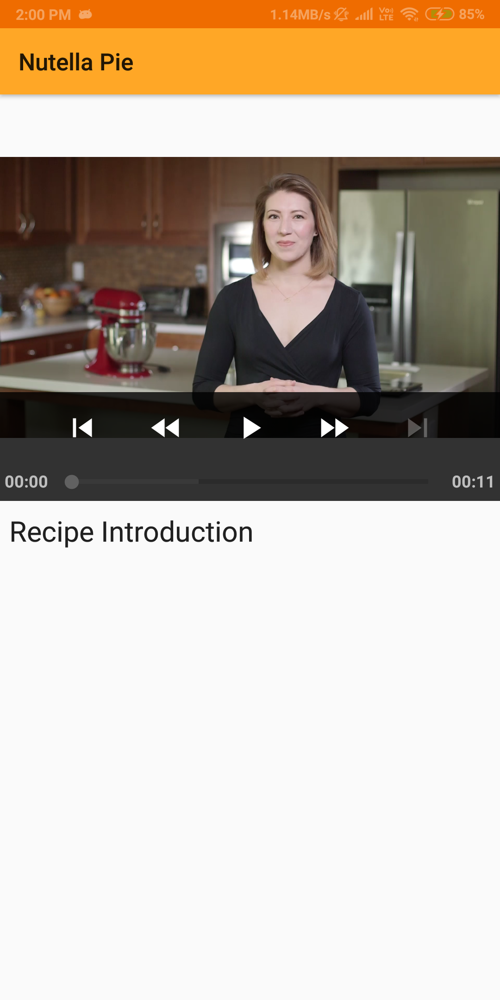

# BakeMe

It uses a static API to fetch recipies and load them in app using Repository pattern.

**Run the app**
1. Clone the app with `.git` url
2. Run the app by <kbd>Shift + F10</kbd> or clicking <kbd>Run</kbd>

#### Screenshots
- Home Screen

- Detail Screen

- Step Video Screen

#### Libraries
- [Google gson](https://github.com/google/gson) For parsing JSON data
- [Retrofit](http://square.github.io/retrofit/) For sending network requests
- [Exoplayer](https://github.com/google/ExoPlayer) For laoding and displaying videos

#### Credits
- [Udacity](https://udacity.com/) For teaching me Android

#### License
GNU General Public License v3.0
